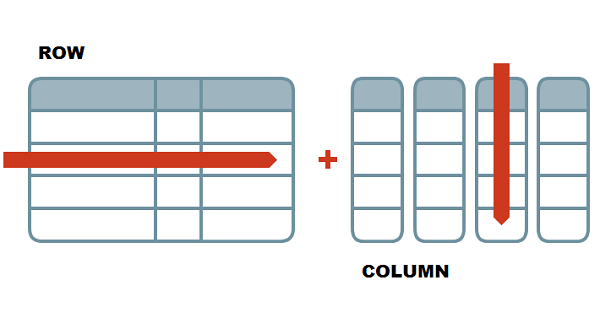

# 2-Dimensional Data in R

### Student Learning Outcomes

-   Students will be able to describe the relationship between vectors and data frames
-   Students will be able to do the following in the R language:
    -   explore and describe data frames
    -   filter specific values from data frames
    -   calculate descriptive statistics from data frames
    -   make histograms

# Working with Data Frames

In our previous lesson, we learned how to run lines of code, create objects using the assignment arrow, and work with 1-dimensional data objects called [vectors]{.underline}.

Most of the data we work with, however, is two-dimensional data (i.e., has columns and rows). Its structure resembles a spreadsheet.

As a friendly reminder:

-   **rows** go side-to-side
-   **columns** go up-and-down

{width="75%" fig-align="center"}

The R language is really good at working with 2-dimensional data objects. In R, we refer to them as [data frames]{.underline}.

Data frames are made up of multiple vectors. Each vector becomes a column in a data frame.

# Set Up

To explore data frames, we are going to use a package called `palmerpenguins`.

A [package]{.underline} is a bunch of pre-written bit of code (usually functions) form of functions, which we can bring into R and use.

In this case, we are using a data package, which loads data into R that we can use. This is real data from penguins in Antarctica! You can learn more about the `palmerpenguins` package and data [here](https://allisonhorst.github.io/palmerpenguins/).

{width="75%" fig-align="center"}

## Installing a Package

The first time that you want to use a certain package, you need to "install" the package, meaning download the contents of the package from the internet into your work space.

I have already installed the `palmerpenguins` package into this Posit Cloud project, so you do not need to install it. I've included the code here for future reference, if you need it.

```{r}
# code for installing a package from the internet ONLY FOR FUTURE REFERENCE
# install.packages("palmerpenguins")
# to run the line of code above, remove the # symbol
```

## Loading a Package

Although we have installed the package, we aren't ready to use it yet. Every time (for us, every new project) we want to use something from a package, we need to tell RStudio that we want to use it. We will need to do that every time we open Posit Cloud.

We do this through a function called `library()`.

```{r}
library(palmerpenguins) 
```

## Exploring the Penguin Data

Let's take a look at our data. The data we are using is in a data frame called `penguins`.

```{r}
penguins
```

A quirk about using data that we've loaded in through a package instead of directly reading in data from a `.csv` file is that the data frame will not show up in our environment unless we specifically tell it to.

```{r}
penguins <- penguins
```

# Functions

As with vectors, there are many functions that are useful for taking a look at data frames. Many of the ones that work with vectors also work with data frames. Here are a few of the ones I find very helpful.

```{r}
head(penguins)         # first 6 rows
head(penguins, n = 10) # can specify how many rows with an additional argument
tail(penguins)         # last 6 rows

str(penguins)   # structure of the object
nrow(penguins)  # number of rows
ncol(penguins)  # number of columns

names(penguins) # same as colnames(penguins) in a data frame
```

# Sub-setting

When sub-setting data frames, we need to now specify 2 locations, the row and the column. In R, it is always row *then* column. The general structure looks like this:

| `dataframe[rows, cols]`

Note that this pattern (rows, columns) is the opposite of how spreadsheets typically describe locations.

As with vectors, there are two ways by which we can subset data: (1) by index and (2) by condition.

## Sub-setting by Index

```{r}
# vectors are 1 dimension, so we only need to specify one location
# data frames are 2-dimensional (rows, columns), so we have to specify 2 different locations

penguins[1:10, c(2,3)] 
penguins[1:10, ] 
penguins[ , c(1:4)]
```

## Selecting an Individual Column

Often, we want to select a specific column to perform calculations on or to plot. We can do this via sub-setting, though the result is a data frame with 1 column, not a vector.

To select one column to treat as a vector, we can use the `$` operator.

```{r}
# with sub-setting by index
penguins[ ,1]    # requires position and creates a data frame with 1 column

# sub-setting with $
penguins$species  # pulling out 1 column by name, as a vector
unique(penguins$species) # we can then place the vector inside of a function

# we can save single columns as vectors with the assignment operator
flipper_lenght_mm <- penguins$flipper_length_mm
```

Using the `$` is a great way to quickly make plots with your data or do calculations.

### Histograms

Let's plot a histogram with the flipper length data.

```{r}
# Plot a histogram
hist(penguins$flipper_length_mm) # same as hist(flipper_length_mm) from above
```

### Calculations

We can also perform calculations on these vectors, such as calculating measures of central tendency and measures of dispersion.

```{r}
mean(penguins$flipper_length_mm)
```

Hmm...that is an odd value. We know that there are numbers in the `flipper_length_mm` column, so why is it returning a "missing" value of `NA`?

Let's look at the help page for the `mean()` function.

The `mean()` function has a few arguments with default settings, one of them being the `na.rm` argument. This determines whether or not the function includes `NA` values in the calculation.

In order to remove the `NA` values (and, therefore, the `NA` result), we need to change the default to the following: `na.rm = TRUE`. This will *remove* `NA` values from the calculation.

```{r}
mean(penguins$flipper_length_mm, na.rm = TRUE)
```

Other functions where this might be necessary include the `median()`, `mode()`, `min()`, `max()`, and `sd()` functions.

## Sub-setting by Condition

As with vectors, we can write conditional statements to select specific observations, which are typically the rows in the data frame.

When setting a condition for which observations to retain, you can think about the process as selecting which rows to keep based on whether or not that row has a specified value in a certain column.

```{r}
# create a new data frame with only Adelie penguins
adelie <- penguins[penguins$species == 'Adelie', ] 
adelie

# histogram with only Adelie penguin flipper lengths
hist(adelie$flipper_length_mm)

# average of only Adelie penguin flippers
mean(adelie$flipper_length_mm)
mean(adelie$flipper_length_mm, na.rm = TRUE)  # remove NA values from calculation
```

We can also use conditional formatting to filter rows based on numeric conditions.

```{r}
# penguins with flippers greater than or equal to 200 mm
flippers_200mm_min <- penguins[penguins$flipper_length_mm >= 200, ] 

# create a histogram
# hist(flippers_200mm_min) # why doesn't this work? We haven't specified a column 
hist(flippers_200mm_min$flipper_length_mm)
```

## Challenge

Write some lines of code to do the following: calculate the minimum (`min()`), maximum (`max()`), and the standard deviation (`sd()`) of the body mass values for Gentoo penguins. Remember the `na.rm` argument!

Then, plot a histogram of the Gentoo body mass data.

```{r}
gentoo <- penguins[penguins$species == "Gentoo", ]
min(gentoo$body_mass_g, na.rm = TRUE)
max(gentoo$body_mass_g, na.rm = TRUE)

hist(gentoo$body_mass_g)
```
