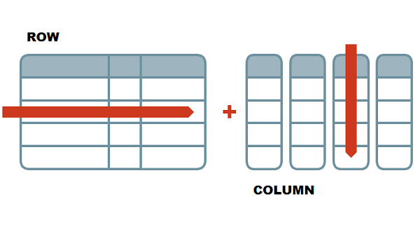

# 2-Dimensional Data in R

### Student Learning Outcomes

-   Students will be able to describe the relationship between vectors and data frames
-   Students will be able to do the following in the R language:
    -   explore and describe data frames
    -   filter specific values from data frames
    -   calculate descriptive statistics from data frames
    -   make histograms

## Working with Data Frames

Most of the data we work with is two-dimensional, i.e., it has columns and rows. Its structure resembles a spreadsheet. Because a single data point needs to be referenced by two positions (which row and which column), we call it 2D.

As a friendly reminder:

-   **rows** go side-to-side
-   **columns** go up-and-down



R is really good at working with these types of data. We call them *data frames*.

Data frames are made up of multiple vectors. Each vector becomes a column in a data frame.

To explore data frames, we are going to use a package called `palmerpenguins`.

A *package* is a bunch of pre-written code, often in the form of functions, which we can bring into R and use. In this case, we are using a data package, which loads data into R that we can use. It is real data from penguins in Antarctica! You can learn more about the `palmerpenguins` package and data [here](https://allisonhorst.github.io/palmerpenguins/).

 \### Installing a Package

The first time that you want to use a certain package, you need to "install" the package, meaning download the contents of the package from the internet into your work space.

I have already installed the `palmerpenguins` package into this Posit Cloud project, so you do not need to install it. I've included the code here for future reference, if you need it.

```{r}
# code for installing a package from the internet for future reference
# install.packages("palmerpenguins")
# to run the line of code above, remove the # symbol
```

### Loading a Package

Although we have installed the package, we aren't ready to use it yet. Every time (for us, every new project) we want to use something from a package, we need to tell RStudio that we want to use it. We will need to do that every time we open Posit Cloud.

We do this through a function called `library()`.

```{r}
library(palmerpenguins) 
```

### Exploring the Penguin Data

Let's take a look at our data. The data we are using is in a data frame called `penguins`.

```{r}
penguins
```

A quirk about using data that we've loaded in through a package instead of directly reading in data from a .csv file is that the data frame will not show up in our environment unless we specifically tell it to.

```{r}
penguins <- penguins
```

## Functions

As with vectors, there are many functions that are useful for taking a look at data frames. Many of the ones that work with vectors also work with data frames. Here are a few of the ones I find very helpful.

```{r}
head(penguins) # first 6 lines 
head(penguins, 10) # can specify how many lines 
tail(penguins) # last 6 lines 

str(penguins) # structure 
nrow(penguins) # number of rows
ncol(penguins) # number of columns

names(penguins) # same as colnames(penguins) in a df
```

### Subsetting using Indexing

When subsetting data frames, we need to now specify 2 locations, the row and the column. In R, it is always row *then* column. Note that this is typically the opposite of spreadsheets.

```{r}
# in vectors, only 1 dimension, so we only need to specify one location
# data frames are 2-dimensional, so he have to specify 2 different locations

penguins[1:10, c(2,3)] 
penguins[1:10, ] 
penguins[ , c(1:4)]
```

### Select individual columns

Often, we want to select a specific column to perform calculations on or to plot. We can do this via subsetting, though the result is a data frame with 1 column, not a vector.

To pull out one column to treat as a vector, we can use the `$` operator.

```{r}
# with subsetting by index
penguins[ ,1]    # requires position and creates a df with 1 column

# subsetting with $
penguins$species  # pulling out 1 column by name, as a vector
unique(penguins$species) # we can then place the vector inside of a function

# we can save single columns as vectors with the assignment operator
flipper_lenght_mm <- penguins$flipper_length_mm
```

### Plot a Histogram

Let's plot a histogram with the flipper length data.

```{r}
# Plot a histogram
hist(penguins$flipper_length_mm) # same as hist(flipper_length_mm)
```

We can also perform calculations on these vectors.

```{r}
mean(penguins$flipper_length_mm)
sd(penguins$flipper_lenght_mm)

# min, max, median, mode are other functions we might want to use
```

### Conditional Subsetting

As with vectors, we can use conditional formatting to select specific observations (typically rows).

```{r}
# create a new data frame with only adelie penguins
adelie <- penguins[penguins$species == 'Adelie', ] 
adelie

hist(adelie$flipper_length_mm)

# dealing with numeric columns with NA values
mean(adelie$flipper_length_mm)
mean(adelie$flipper_length_mm, na.rm = TRUE)
```

We can also use conditional formatting to filter rows based on numeric conditions.

```{r}
# penguins with flippers greater than or equal to 200 mm
flippers_200mm_min <- penguins[penguins$flipper_length_mm >= 200, ] 

# create a histogram
# hist(flippers_200mm_min) # why doesn't this work? We haven't specified a column 
hist(flippers_200mm_min$flipper_length_mm)
```

### Challenge

Write some lines of code to do the following: calculate the minimum (`min()`), maximum (`max()`), and the standard deviation (`sd()`) of the body mass values for Gentoo penguins. Remember the `na.rm` argument!

Then, plot a histogram of the Gentoo body mass data.

```{r}
gentoo <- penguins[penguins$species == "Gentoo", ]
min(gentoo$body_mass_g, na.rm = TRUE)
max(gentoo$body_mass_g, na.rm = TRUE)

hist(gentoo$body_mass_g)
```
